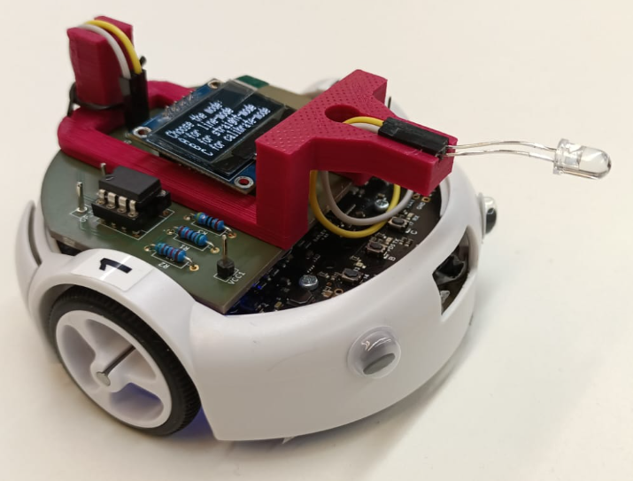

# Automated driving of a robot to a given coordinate

## Overview
In the winter semester of 2023, as part of the "Methodical System Development" module at Darmstadt University of Applied Sciences, we were given the task of modifying a robot so that it can travel to a given coordinate.
The robot provided to us is the Pololu 3pi+ ATMega 32U4, for which we have to design a receiving circuit that is placed on a circuit board we have developed. It is also necessary to program the microcontroller so that the received coordinates can be processed precisely and quickly in order to control the robot accordingly.

In addition, the groups were provided with a 0.96 inch OLED SSD1306 display, for which a code had to be written. This code makes it possible to display relevant information such as the travel time and the controlled coordinate on the display while the robot is in use. 

### Picture

